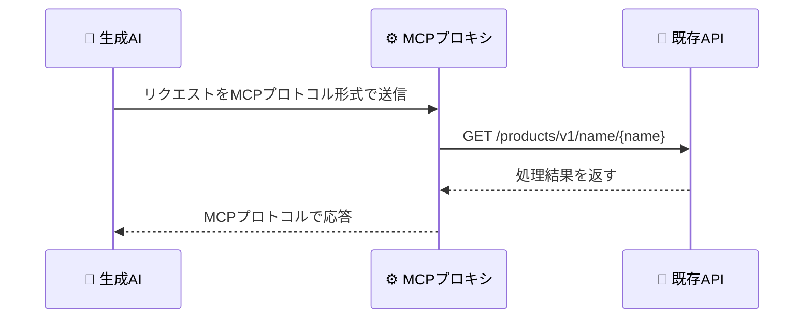
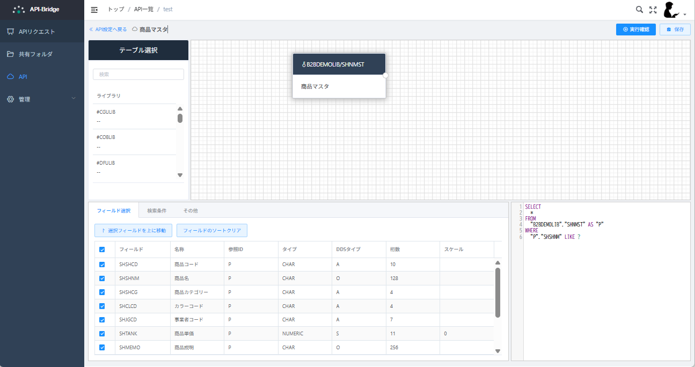
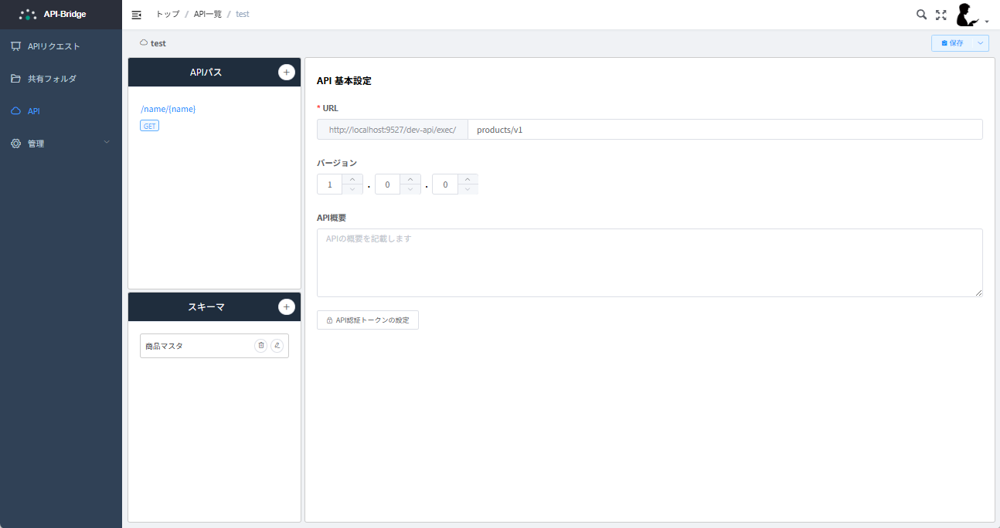

# 既存のAPIをMCPサーバー化する

## はじめに

AIコーディングツールの普及に伴い、AIツールから外部APIを直接呼び出すニーズが急速に増加しています。しかし、従来のREST APIをAIツールから利用するには、APIの仕様を詳細に説明したり、専用のプラグインを開発する必要がありました。

本記事では、既存のREST APIをMCP（Model Context Protocol）サーバーとして構成し、Claude CodeなどのAIツールが直接API仕様を理解して呼び出せる環境を構築する技術的アプローチについて解説します。

## MCPとは何か

MCP（Model Context Protocol）は、Anthropic社が開発したAIアプリケーションと外部データソース・ツールを接続するためのオープンスタンダードプロトコルです。MCPを使用することで、AIツールは以下の3つの機能にアクセスできます：

- **Tools**: 外部システムの機能を実行（API呼び出し、計算、ファイル操作など）
- **Resources**: 構造化データへのアクセス（ファイル、データベース、APIドキュメントなど）
- **Prompts**: 再利用可能なプロンプトテンプレート

## 構成図

以下のような構成を作成します。MCPプロキシを介することで生成AIが既存APIを簡単に利用できるようになります。



## デモ環境の準備

今回は既存APIの準備として、弊社MONO-XのAPI Bridgeを使用します。API Bridgeは様々なクラウドサービスやSaaSサービスとIBM i（AS/400）の基幹データをAPIで繋ぐソリューションとして開発され、IBM i（AS/400）データ連携の架け橋として生まれました。本記事では、API BridgeのデータベースをREST APIとして公開する機能を使用します。詳細は[こちら](https://cs.mono-x.com/hc/ja/articles/12161250967193-API-Bridge%E3%81%A8%E3%81%AF)をご参照ください。

API BridgeはB2B向けのプロダクトのため、今回の記事では詳細な導入手順は割愛させていただきます。お手持ちの既存REST APIや、ExpressやFastAPIなどで作成した簡単なモックAPIサーバーをご準備いただければ、同様に動作確認が可能です。

API Bridgeでデモ用のAPIをローカルPCに準備しました。商品名で商品を検索するシンプルなAPIです。




```
GET http://localhost:9527/dev-api/exec/products/v1/name/{productName}
```

例：「生産管理システム」を含む商品を検索
```
http://localhost:9527/dev-api/exec/products/v1/name/%25生産管理システム%25
```

## MCPプロキシツールの導入

既存のAPIをMCP化するために、専用のプロキシツール「mcpify」を開発しました。このツールは、REST APIのエンドポイントを自動的にMCPツールとして変換します。

### mcpifyの特徴

- REST APIエンドポイントを自動的にMCPツールに変換
- 標準入出力（stdio）とHTTP両方の通信方式をサポート
- 設定ファイルによる柔軟なカスタマイズ
- 複数のAPIを同時にプロキシ可能

### インストール

```bash
curl -sSL https://raw.githubusercontent.com/f-asai-monox/mcpify/main/install.sh | bash
```

### 設定ファイルの作成

MCPには標準出力（stdio）とHTTPの2つの通信方式があります。今回はClaude Codeとの統合が簡単な標準出力方式を使用します。

既存APIをプロキシするための設定ファイル `config.json` を作成します。設定ファイルの詳細について知りたい方は[こちら](https://github.com/f-asai-monox/mcpify/blob/main/docs/CONFIGURATION.md)をご覧ください。


```json
{
  "apis": [
    {
      "name": "products-api",
      "baseUrl": "http://localhost:9527/dev-api",
      "authentication": {
        "type": "header",
        "header": "X-API-Key",
        "value": "your-api-key-here"
      },
      "endpoints": [
        {
          "name": "search_products_by_name",
          "description": "商品名で商品を検索します",
          "method": "GET",
          "path": "/exec/products/v1/name/{productName}",
          "parameters": [
            {
              "name": "productName",
              "type": "string",
              "required": true,
              "description": "検索する商品名（部分一致、%でワイルドカード指定可）",
              "in": "path"
            }
          ]
        }
      ]
    }
  ]
}
```

## Claude CodeへのMCP設定

Claude Codeの設定ファイル（`~/.config/claude/mcp_settings.json`）に以下の内容を追加します：

```json
{
  "mcpServers": {
    "products-api": {
      "command": "mcp-server-stdio",
      "args": ["-config", "/path/to/your/config.json"],
      "env": {}
    }
  }
}
```

### ローカル設定ファイルの配置例

```bash
# 設定ディレクトリを作成
mkdir -p ~/.config/claude

# MCP設定ファイルを編集
nano ~/.config/claude/mcp_settings.json

# API設定ファイルを配置（例：ホームディレクトリ）
cp config.json ~/mcp-configs/products-api-config.json
```

実際の設定例（絶対パスを使用）：

```json
{
  "mcpServers": {
    "products-api": {
      "command": "mcp-server-stdio",
      "args": ["-config", "/home/username/mcp-configs/products-api-config.json"],
      "env": {}
    }
  }
}
```

設定後、Claude Codeを再起動すると、MCPサーバーが自動的に起動されます。

## 実際の使用例

### 例1: 商品検索

Claude Codeに以下のように依頼します：

```
「トルク」という名前を含む商品を検索してください
```

Claude Codeは自動的に`search_products_by_name`ツールを使用し、APIを呼び出して結果を返します。

### 実行結果の例

```json
{
  "success": true,
  "data": {
    "id": 12345,
    "name": "デジタルトルクレンチ",
    "price": 45000,
    "description": "高精度デジタル表示付きトルクレンチ",
    "created_at": "2024-01-15T10:30:00Z"
  }
}
```

## 他の選択肢

今回は自作のツールを使用しましたが、REST APIをMCP化する実際のOSSプロジェクトが多数存在します。  
プロジェクトの要件に応じて、最適なツールを選択することをお勧めします。

## まとめ

既存のREST APIをMCPサーバー化することで、以下のメリットが得られます：

1. **開発効率の向上**: AIツールが直接APIを理解し、適切に呼び出せる
2. **ドキュメントの自動化**: API仕様がそのままAIツールのドキュメントとして機能
3. **柔軟な統合**: 既存システムを変更することなくAI機能を追加可能

ただし、セキュリティには十分な注意が必要です。適切な認証・認可の設定、ネットワークセキュリティの確保、監査ログの実装など、本番環境での使用前に必ずセキュリティ対策を実施してください。

MCPを活用することで、既存のAPIリソースをより効果的に活用し、AI時代に適応したシステム構築が可能になります。今後もMCPエコシステムの発展とともに、さらなる活用方法が生まれることが期待されます。

## 参考リンク

- [MCP公式ドキュメント](https://modelcontextprotocol.io/)
- [mcpifyリポジトリ](https://github.com/f-asai-monox/mcpify)
- [Claude Code](https://claude.ai/code)
- [API Bridge製品ページ](https://cs.mono-x.com/hc/ja/articles/12161250967193-API-Bridge%E3%81%A8%E3%81%AF)